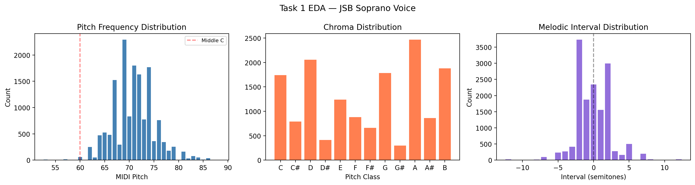
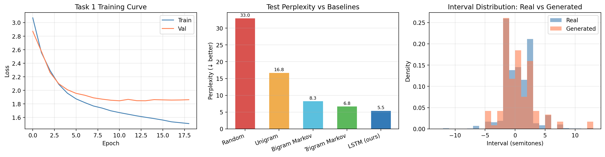
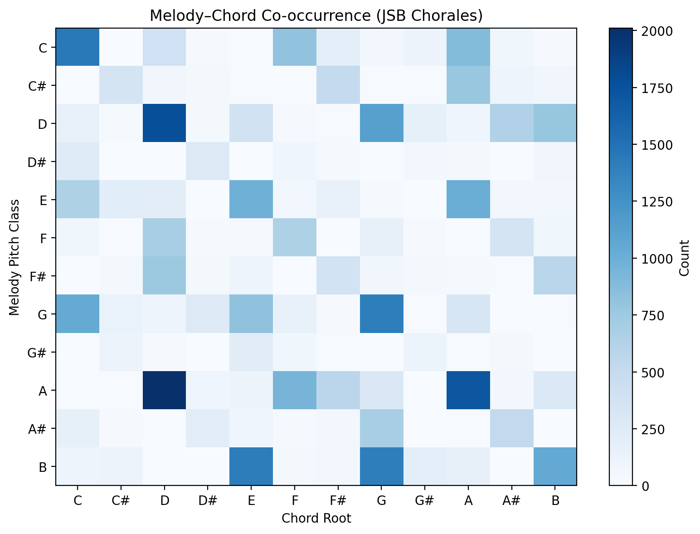
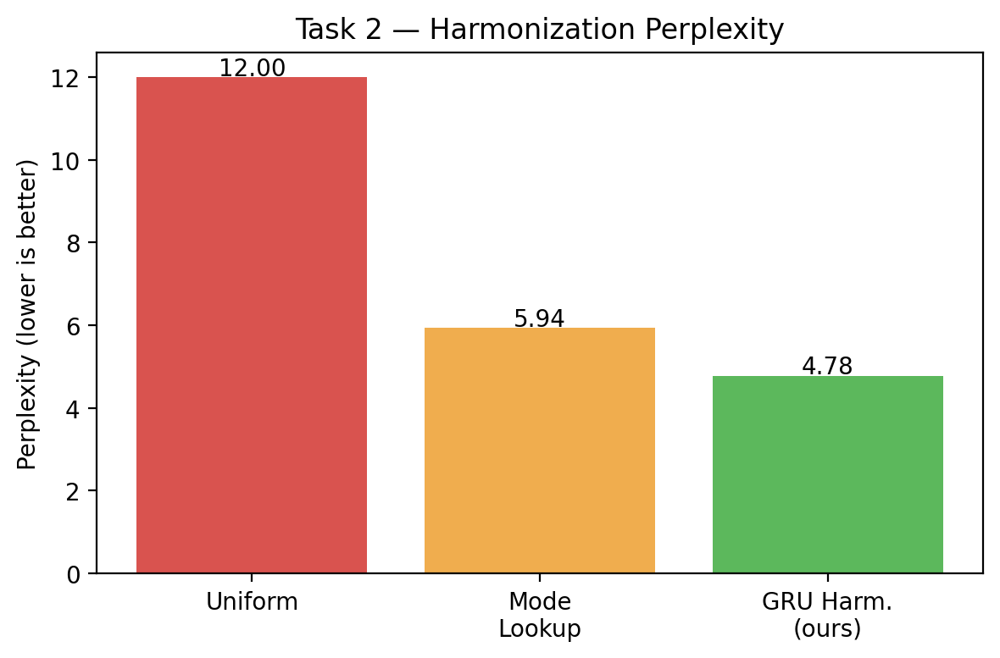

# Symbolic Music Generation: Melody Modeling & Chord Harmonization

`Python` `PyTorch` `LSTM` `Seq2Seq` `RNN` `Sequence Modeling`

Two sequence modeling tasks on Bach's chorale melodies (symbolic/MIDI data, not audio): generating
novel soprano melodies, and predicting chord accompaniment for a given melody.

## Task 1 — Unconditioned melody generation

Autoregressive language model over soprano pitch sequences: `p(x_1, ..., x_N) = Π p(x_t | x_<t)`.

- **Model**: 2-layer LSTM, trained with early stopping on 410 Bach chorales (70/15/15 split by
  chorale).
- **Baselines**: unigram / bigram / trigram Markov models over the same pitch vocabulary.
- **Result**: LSTM reaches **perplexity 5.45**, beating the trigram baseline (6.77) and bigram
  (8.32) — the model is capturing longer-range melodic structure than local n-gram statistics can.
  Sampled melodies also match the real melodic-interval distribution closely.
- Novel, non-memorized melodies are sampled from the trained model and written out as MIDI.

## Task 2 — Conditioned generation: melody → chord harmonization

Seq2Seq problem: given a soprano melody (pitch-class sequence), predict the chord root at each
beat: `p(chord | melody)`.

  

- **Model**: Encoder-Decoder GRU — encoder reads the full melody, decoder generates chord roots
  beat-by-beat using scheduled/teacher-forced decoding (teacher-forcing ratio decayed over
  training).
- **Baselines**: uniform prediction over 12 chord classes, and a mode-lookup table (most frequent
  chord root per melody pitch-class).
- **Result**: GRU reaches **perplexity 4.78** and **44% beat-level accuracy**, beating mode-lookup
  (PPL 5.94) on both metrics.
- Harmonized output is rendered as a 4-voice MIDI file (soprano melody + predicted chords).

  

## Limitations

Task 2 uses a pair-level train/val split, which carries a mild data-leakage risk (a chorale could
appear in both splits via different melody/chord pairings); a chorale-level split would remove this
at the cost of less training data — noted as a direction for follow-up.

## Repo contents

- `symbolic_music_generation.ipynb` — both tasks end-to-end: data loading (via `music21`), EDA,
  model definitions, training, baseline comparison, evaluation, and MIDI export.
- `symbolic_unconditioned.mid`, `symbolic_conditioned.mid` — generated output for Task 1 and Task 2.

---
Final project for ECE 253R: Machine Learning for Music, UC San Diego.
